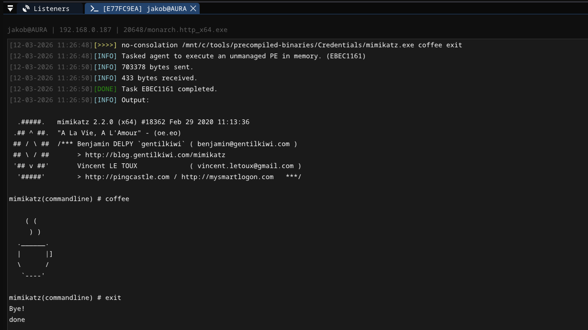
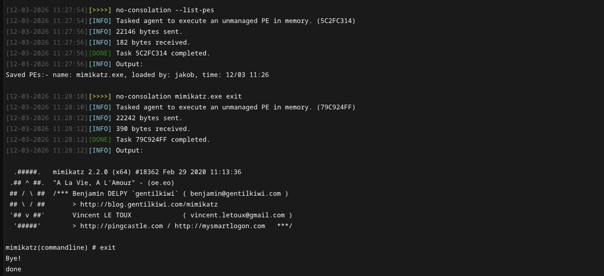

# Execution Modules <!-- omit from toc -->

## Contents <!-- omit from toc -->

- [Overview](#overview)
  - [no-consolation](#no-consolation)
  - [bof-async](#bof-async)

## Overview

The execution modules provide commands for executing binaries and code in memory on the target system. The module contains the following commands: 

```
 * no-consolation           Execute an unmanaged PE in memory.
 * bof-async                Execute an object file asynchronously in the background.
```

### no-consolation
Execute an unmanaged Windows PE (EXE or DLL) in memory using [No-Consolation](https://github.com/iilegacyyii/No-Consolation). The binary is sent from the operator client or loaded directly from disk on the target. Previously executed PEs are cached in memory and can be re-executed by name without re-uploading.

```
Usage  : no-consolation <path> [arguments] [flags]
Example: no-consolation --local C:\Windows\System32\calc.exe
         no-consolation /mnt/c/tools/precompiled-binaries/Credentials/mimikatz.exe coffee exit

Required arguments:
  path                      STRING     Full path to the EXE/DLL to execute, or the name of a
                                       previously cached PE already loaded in memory.

Optional arguments:
  arguments                 STRING     Arguments to pass to the binary.

Optional flags:
  --local                   BOOL       Load the binary from disk on the target instead of uploading it.
  --inthread                BOOL       Run the PE on the main thread. May hang the agent.
  --link-to-peb             BOOL       Load the PE into the PEB.
  --dont-unload             BOOL       Do not unload the PE from memory after execution.
  --timeout <seconds>       INT        Seconds to wait for completion (default: 60, 0 to disable).
                                       Not compatible with --inthread.
  -k                        BOOL       Overwrite the PE headers after loading.
  --method <method>         STRING     Export method/function name for DLLs (default: DllMain).
  -w                        BOOL       Pass command line arguments in UNICODE format (default: ANSI).
  --no-output               BOOL       Do not capture output.
  --alloc-console           BOOL       Allocate a console for output (spawns a new process).
  --close-handles           BOOL       Close pipe handles after execution.
  --dont-save               BOOL       Do not cache this PE in memory after execution.
  --list-pes                BOOL       List all PEs currently loaded in memory.
  --unload-pe <PE_NAME>     STRING     Unload a specific PE from memory by name.
  --free-libs <DLLS>        STRING     Comma-separated list of DLLs to unload from memory.
  --load-all-deps           BOOL       Manually load all PE dependencies.
  --load-all-deps-but <DLLS> STRING    Manually load all dependencies except those specified (comma-separated).
  --load-deps <DLLS>        STRING     Manually load only the specified dependencies (comma-separated).
  --search-paths <PATHS>    STRING     Custom search paths for dependency resolution (comma-separated).
```

> [!WARNING]
> When the agent is set to use `verbose` mode, the output of the PEs is written to the console where the agent is running. Uncheck `verbose` during payload generation or use DLL/Service payloads to get the output redirected to the agent console in the Conquest client. 





### bof-async

Execute an object file asynchronously in the background. This command requires the `async-bof.dll` DLL to exist in `data/resources/async-bof-loader` in order to work.

```
Usage: bof-async <object-file> [arguments]
Example: bof-async /path/to/process-notify.x64.o <packed-args>

Required arguments:
  object-file               STRING     Path to the object file to execute.

Optional arguments:
  arguments                 STRING     Arguments to be passed to the object file, packed as a HEX string.
```

In order to create the `arguments` HEX-string, it is recommended to use the [beacon_generate.py](https://github.com/trustedsec/COFFLoader/blob/main/beacon_generate.py) script provided by trustedsec. 