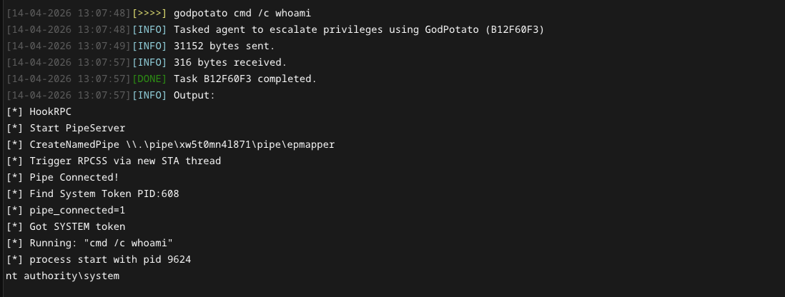
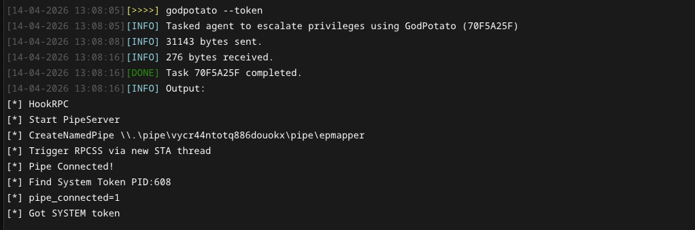

# Privilege Escalation Modules <!-- omit from toc -->

## Contents <!-- omit from toc -->

- [Overview](#overview)
  - [privkit](#privkit)
  - [godpotato](#godpotato)

## Overview

The privilege escalation modules provide commands for identifying and exploiting local privilege escalation vectors on Windows systems. Checks are implemented as BOF wrappers for [PrivKit](https://github.com/mertdas/PrivKit) and other BOF files. The module contains the following commands: 

```
 * privkit                  Run Windows privilege escalation checks.
```

### privkit
Run one or all Windows privilege escalation checks. Specify `all` to execute every check sequentially.

```
Usage  : privkit <check>
Example: privkit unquoted-svc-path

Required arguments:
  check                     STRING     Privilege escalation check to run. See table below.
```

| Check | Description |
| --- | --- |
| `all` | Run all checks sequentially. |
| `always-install-elevated` | Check if AlwaysInstallElevated registry keys are set, allowing MSI packages to install with SYSTEM privileges. |
| `autologon` | Check for plaintext credentials stored in the AutoLogon registry keys. |
| `cred-manager` | Enumerate credentials stored in the Windows Credential Manager. |
| `hijack-path` | Identify directories in the system PATH that are writable by the current user. |
| `modify-autorun` | Check for autorun registry entries pointing to binaries writable by the current user. |
| `modify-svc` | Identify services whose binary paths are writable by the current user. |
| `token-privs` | List token privileges assigned to the current process and flag potentially abusable ones. |
| `unquoted-svc-path` | Find services with unquoted binary paths containing spaces, enabling binary planting. |
| `ps-history` | Check for a PowerShell history file and retrieve its contents. |
| `uac-status` | Retrieve the current UAC configuration and elevation level. |

### godpotato
Use GodPotato to escalate privileges to NT AUTHORITY\SYSTEM via SeImpersonatePrivilege. Without arguments, the BOF steals the SYSTEM token and applies it to the current session.

```
Usage: godpotato [command] [--pipe pipe] [--token]
Example: godpotato cmd /c whoami --pipe my-custom-pipe

Optional arguments:
  command                   STRING     Command to execute (default: "cmd /c whoami").
  --pipe pipe               STRING     Pipe to write output to.
```


